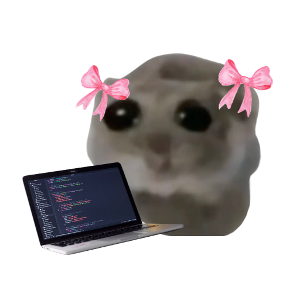

  

# Nicole Lehmeyer

## **About Me:**

My name is **Nicole Lehmeyer**, and I am studying **software development** at **42 Adelaide**.

I love all things to do with the real-world applications of technology!

I have a background in human psychology and communication \(from my BA. Speech Pathology\) and hope to leverage these skills to bridge the gap between human factors and technology.

## Currently:

Working on 42 Project **'Philosophers'**, incorporating concepts such as **threads, mutexes, and concurrent programming**.

## Ultimately:

Would love to work in **HSI/project management/software development/systems engineering.**

## Loving:

Fashion, Grimes, cats and trains

## Contact me:

**LinkedIn:** [nicole-lehmeyer](https://www.linkedin.com/in/nicole-lehmeyer/)

**Discord:**  [nicole.lehmeyer](https://discordapp.com/users/1107446949344448543/)

---

Made by NicoleLehmeyer: <a href=mailto:"nlehmeye@student.42adel.org.au">nlehmeye@student.42adel.org.au</a> | LinkedIn: <a href="https://www.linkedin.com/in/nicole-lehmeyer/">nicole-lehmeyer</a> | Discord: <a href="https://discordapp.com/users/1107446949344448543/">nicole.lehmeyer</a>

  

